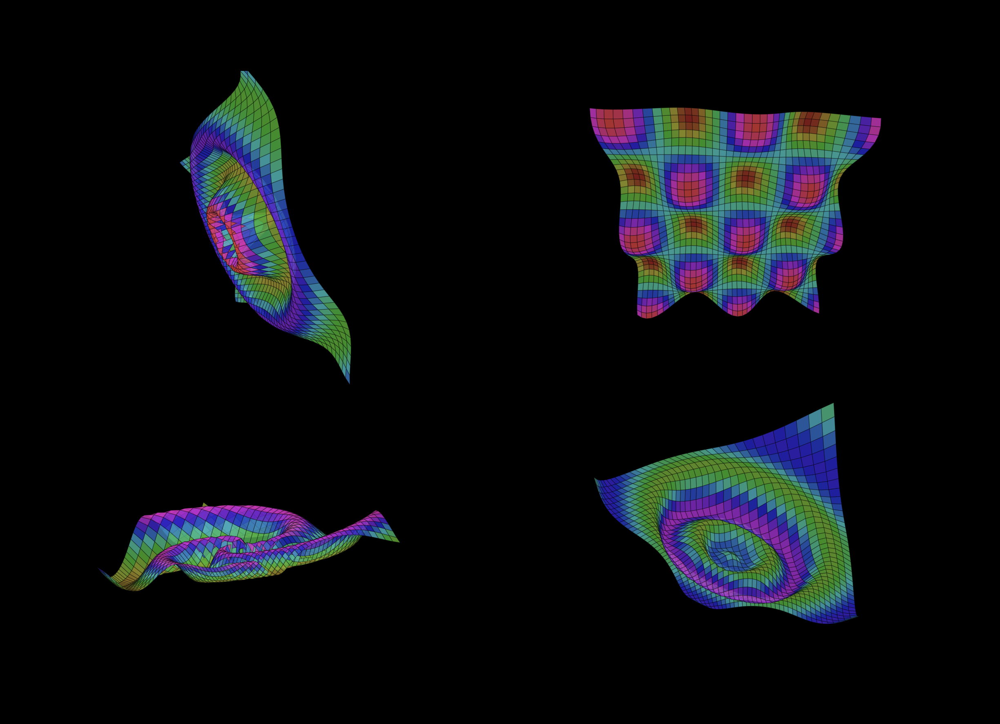

# 3D Vector Animations in Elm

A modernized Elm demo showcasing four distinct animated 3D grid visualizations with interactive rotation, diverse wave patterns, and vibrant color spectrums.

[](https://ninjaconcept.github.io/elm-vector-demo-1/)

**[🌐 Live Demo](https://ninjaconcept.github.io/elm-vector-demo-1/)**

## Features

- **Four unique wave animations**: Classic ripples, X-Y grid waves, spiral patterns, and complex interference
- **Responsive layout**: Adapts from 2x2 grid on desktop to single column on mobile
- **Interactive 3D rotation**: Mouse/touch controls with smooth interpolation
- **Vibrant color mapping**: Enhanced spectrum with dynamic hue cycling
- **Real-time rendering**: 30fps 3D projection with z-depth sorting
- **Mathematical precision**: Custom wave functions with time-based animation

## Technical Details

### Wave Functions
- **Classic Ripples**: Expanding circular waves with amplitude decay
- **X-Y Grid Waves**: Orthogonal sine wave interference patterns
- **Spiral Waves**: Radial waves with angular offset creating spiral motion
- **Complex Interference**: Multi-source wave interference with time modulation

## Setup

1. **Install Elm** (if not already installed):
   ```bash
   npm install -g elm
   ```

2. **Install dependencies**:
   ```bash
   elm install
   ```

3. **Start development server**:
   ```bash
   elm reactor
   ```

4. **View the demo**:
   - Open http://localhost:8000 in your browser
   - Navigate to `src/Main.elm` to see the animation

5. **Build for production**:
   ```bash
   ./build-demo.sh
   ```

## Project Structure

- `src/Main.elm` - Main application with 3D math and rendering logic
- `docs/` - GitHub Pages deployment with optimized build
- `elm.json` - Project dependencies and configuration
- `build-demo.sh` - Production build script for GitHub Pages

## Browser Compatibility

Optimized for modern browsers with SVG and CSS Grid support:
- Chrome 57+, Firefox 52+, Safari 10.1+, Edge 16+
- Mobile Safari iOS 10.3+, Chrome Mobile 57+

## Notes

This project has been modernized from Elm 0.18 to 0.19.1 with:
- Removed deprecated OpenSolid geometry library
- Custom 3D projection and rotation mathematics
- Modern Elm Browser.element architecture
- Updated Time and animation handling
- Enhanced responsive design and color systems
